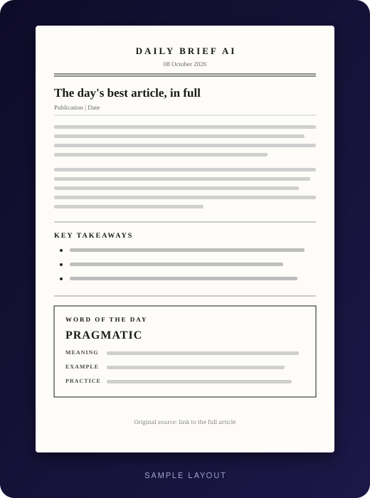
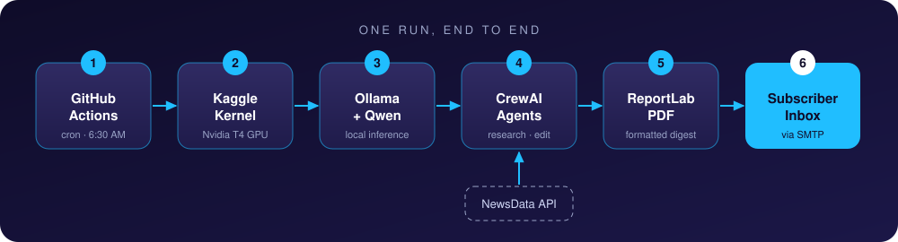
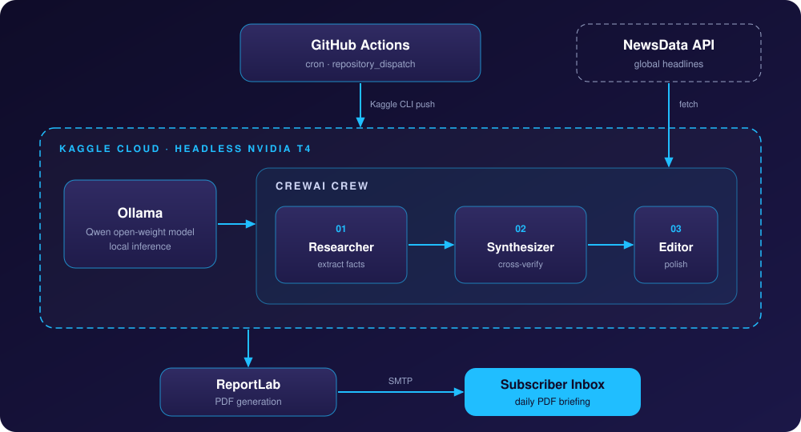

<div align="center">


<a href="https://github.com/bytebymanas/sift-ai">
  
</a>

<br/>

[](https://github.com/bytebymanas/sift-ai/actions)
[](https://github.com/bytebymanas/sift-ai/commits)
[](https://github.com/bytebymanas/sift-ai/stargazers)


<br/>

**[How it works](#-how-it-works)** &nbsp;·&nbsp; **[The agents](#-the-agents)** &nbsp;·&nbsp; **[Setup](#-setup)** &nbsp;·&nbsp; **[Customize](#-customize-your-feed)** &nbsp;·&nbsp; **[FAQ](#-faq)**

</div>

<br/>

## ◈ The Idea

Most news is noise. **Sift AI** reads the day's candidates and hands you exactly one article worth your time, complete with key takeaways and a word of the day to grow your vocabulary.

Every morning a GitHub Actions workflow launches a Kaggle notebook. Inside it, a small crew of AI agents running open-source Qwen models collects fresh stories, picks the strongest one, summarizes it, chooses a useful English word, and emails everything to you as a clean PDF.

No server stays on. No LLM API is billed. Nobody has to press a button.

<table>
<tr>
<td align="center" width="25%"><h3>06:30</h3><sub>Fires daily on schedule</sub></td>
<td align="center" width="25%"><h3>1 Article</h3><sub>Chosen from ~20 candidates</sub></td>
<td align="center" width="25%"><h3>4 Agents</h3><sub>Select · Summarize · Vocab</sub></td>
<td align="center" width="25%"><h3>$0</h3><sub>Inference cost</sub></td>
</tr>
</table>

<br/>

## ◈ What Lands In Your Inbox

<table>
<tr>
<td width="58%" valign="middle">

<h3>A clean, print-ready PDF, every morning</h3>

<ul>
<li><b>The full article</b>, scraped and cleaned, word for word</li>
<li><b>Key takeaways</b>, 3 to 5 concrete facts pulled from the text</li>
<li><b>Word of the day</b>, an everyday English word with its meaning, an example and a practice scenario</li>
<li><b>Source link</b> back to the original publication</li>
</ul>

<p><b>The article is never rewritten by an AI.</b> The body passes through a deterministic scraper and cleaner untouched. Models are only used for judging, summarizing and teaching.</p>

</td>
<td width="42%" align="center" valign="middle">

</td>
</tr>
</table>

<br/>

## ◈ How It Works

<div align="center">
  
</div>

| Step | What happens |
| :---: | :--- |
| **1** | GitHub Actions fires on the cron schedule (or a `repository_dispatch` event) and pushes the notebook to Kaggle with the CLI |
| **2** | Kaggle starts a T4 GPU kernel. The notebook installs Ollama and pulls the two Qwen models |
| **3** | It queries NewsData for each of your topics (globally and India-scoped) and reads editorial RSS feeds, then scrapes and cleans every candidate |
| **4** | The Senior News Editor agent picks the one article that best rewards a reader's time |
| **5** | Two lighter agents extract takeaways and choose a word of the day |
| **6** | A fixed HTML template is rendered to PDF with WeasyPrint and sent through Gmail |

<br/>

## ◈ Architecture

<div align="center">
  
</div>

<br/>

## ◈ The Agents

Two models, four agents. The bigger model does the one job that needs real judgment. The smaller one handles tasks on a single, already-clean input.

| Agent | Model | Job |
| :--- | :--- | :--- |
| **Senior News Editor** | Qwen 2.5 · 7B Instruct | Compares all candidates and picks exactly one, or declares that none qualify |
| **Content Summarizer** | Qwen 3 · 1.7B | Extracts 3 to 5 specific takeaways, never inventing a claim |
| **Vocabulary Word Selector** | Qwen 3 · 1.7B | Picks one common, everyday English word, ignoring the article's topic |
| **English Vocabulary Coach** | Qwen 3 · 1.7B | Explains that word with a meaning, example and practice scenario. It never sees the article |

<details>
<summary><b>How the editor chooses</b></summary>
<br/>

The editor scores candidates in this order of priority:

1. Factual substance and depth
2. Credibility of the source and reporting
3. Learning value: a real argument, the "why" and not just the "what", and precise vocabulary
4. Real-world importance
5. Recency, only as a tie-breaker

Hard filters remove listicles, clickbait, press releases and vague "experts say" sourcing. Opinion and news are judged equally, with no built-in favorite.

</details>

<details>
<summary><b>What happens on a bad news day</b></summary>
<br/>

The pipeline never forces a weak pick and never fails silently.

| Attempt | Minimum length | Behavior |
| :---: | :---: | :--- |
| 1 | 220 words | Strict bar. The editor may reject everything |
| 2 | 150 words | Looser bar, topic match no longer a reason to reject |
| 3 | 120 words | Last chance. Picks the best acceptable candidate |
| Fallback | n/a | No LLM call. Picks the best known-reliable, longest candidate |

The article is scraped once. Retries only re-run the cheap selection step.

</details>

<br/>

## ◈ Setup

### 1. Clone and point to your Kaggle account

```bash
git clone https://github.com/bytebymanas/sift-ai.git
cd sift-ai
```

Edit `kernel-metadata.json` and replace the username:

```json
{
  "id": "YOUR_KAGGLE_USERNAME/sift-ai-daily-runner",
  "title": "Sift AI Daily Runner",
  "code_file": "sift-ai.ipynb",
  "language": "python",
  "kernel_type": "notebook",
  "is_private": true,
  "enable_gpu": true,
  "enable_internet": true
}
```

### 2. Add your secrets in Kaggle

Secrets live in Kaggle, never in this repo. Push the notebook once (step 4) so it exists in your account, then open it on Kaggle and go to **Add-ons → Secrets**. Add these four, with the names matching **exactly**, and make sure each one is attached to the notebook:

| Secret name | What to put in it |
| :--- | :--- |
| `NEWSDATA_API_KEY` | Your API key from [newsdata.io](https://newsdata.io) |
| `GMAIL_ADDRESS` | The Gmail address the brief is **sent from** |
| `GMAIL_APP_PASSWORD` | A Google **app password** for that sender account (not your normal password) |
| `RECIPIENT_EMAIL` | The address that **receives** the brief. It can be the same as the sender |

<details>
<summary><b>How to get a Google app password</b></summary>
<br/>

1. Open your Google Account and go to **Security**
2. Turn on **2-Step Verification** if it is not already on
3. Open **App passwords**, create one, and copy the 16-character code
4. Paste that code into the `GMAIL_APP_PASSWORD` secret

</details>

> Internet access must be on for the notebook (the NewsData API, RSS feeds, article scraping and email all need it). The `"enable_internet": true` line in `kernel-metadata.json` handles this when you push through the CLI.

### 3. Add your Kaggle credentials to GitHub

In your repository go to **Settings → Secrets and variables → Actions** and add `KAGGLE_USERNAME` and `KAGGLE_KEY`. Get the key from your Kaggle account settings by creating a new API token. The workflow uses these to push the notebook.

### 4. Run it once by hand

```bash
export KAGGLE_USERNAME="your_username"
export KAGGLE_KEY="your_api_key"

kaggle kernels push -p .
```

### 5. Let it run

From here the scheduled workflow takes over, and a fresh brief arrives every morning.

<br/>

## ◈ Customize Your Feed

Open `sift-ai.ipynb` and edit the configuration cell near the top. Commit and push, and the next scheduled run uses your changes.

**Topics you care about** (`USER_PREFERRED_TOPICS`). These are a preference, not a filter. A great article outside your topics still beats a mediocre one inside them.

```python
USER_PREFERRED_TOPICS = [
    "latest technology inventions",
    "politics",
    "artificial intelligence",
    "business",
    "technology",
    "economy",
    "world news",
    "AI companies",
]
```

**Trusted sources** (`TRUSTED_SOURCES`). Publications listed here get a credibility boost when the editor compares candidates. This is a soft signal, not a hard filter, so niche topics never end up with an empty pool. Names must be lowercase and match the publication name NewsData reports.

```python
TRUSTED_SOURCES = {
    "reuters", "associated press", "ap", "bbc", "the guardian", "bloomberg",
    "the new york times", "the washington post", "npr", "the wall street journal",
    "the hindu", "the indian express", "hindustan times", "livemint",
    "business standard", "press trust of india", "pti",
}
```

**Editorial and opinion feeds** (`EDITORIAL_FEEDS`). These RSS feeds are read directly, because news APIs mostly index wire news rather than opinion sections. Add any publication that offers an RSS feed.

```python
EDITORIAL_FEEDS = {
    "The Hindu": "https://www.thehindu.com/opinion/editorial/feeder/default.rss",
    "The Hindu (Op-Ed)": "https://www.thehindu.com/opinion/op-ed/feeder/default.rss",
    "Indian Express (Editorials)": "https://indianexpress.com/section/opinion/editorials/feed/",
    "Indian Express (Columns)": "https://indianexpress.com/section/opinion/columns/feed/",
    "Hindustan Times (Editorials)": "https://www.hindustantimes.com/feeds/rss/editorials/rssfeed.xml",
}
```

<br/>

## ◈ Tech Stack

| Layer | Tooling |
| :--- | :--- |
| **Orchestration** | GitHub Actions (`cron`, `repository_dispatch`) |
| **Compute** | Kaggle GPU kernels · Nvidia T4 · Python 3.10 |
| **LLM inference** | Ollama · Qwen 2.5 7B Instruct · Qwen 3 1.7B |
| **Agents** | CrewAI |
| **Sources** | NewsData API · RSS via `feedparser` |
| **Scraping** | `requests` · BeautifulSoup |
| **Output** | HTML template · WeasyPrint (PDF) · Gmail SMTP |

<br/>

## ◈ Design Decisions

<details open>
<summary><b>Headless API, not browser automation</b></summary>
<br/>

The first version drove Google Colab through Playwright. It worked until the DOM changed. Sift AI now talks to Kaggle directly through its official CLI.

| | Legacy (Playwright + Colab) | **Sift AI (Kaggle API)** |
| :--- | :--- | :--- |
| **Execution** | Simulated browser clicks | **Direct CLI dispatch** |
| **Authentication** | Session cookies, UI logins | **Scoped API key** |
| **Reliability** | Breaks on DOM changes and captchas | **Deterministic cloud execution** |
| **Overhead** | Browser boot, DOM parsing | **Lightweight API payload** |

</details>

<details>
<summary><b>Models judge, code handles the text</b></summary>
<br/>

Scraping and cleaning are deterministic, so the article reaches you exactly as published. Models only do what they are good at: comparing candidates, extracting takeaways and teaching a word.

</details>

<details>
<summary><b>Open-weight models, not paid APIs</b></summary>
<br/>

Qwen served through Ollama means no per-token billing and no vendor lock-in.

</details>

<br/>

## ◈ Repository Structure

```text
sift-ai/
├── .github/
│   └── workflows/
│       └── daily_colab_trigger.yml   # Cron + dispatch automation
├── assets/                           # README graphics
├── sift-ai.ipynb                     # Full pipeline: collect, select, summarize, PDF, email
├── kernel-metadata.json              # Kaggle GPU execution spec
└── README.md
```

<br/>

## ◈ FAQ

<details>
<summary><b>Do I need a GPU or a server?</b></summary>
<br/>
No. The GPU is a Kaggle T4 that spins up for the run and shuts down afterwards. GitHub Actions is the only thing that wakes it.
</details>

<details>
<summary><b>Can I trigger a run outside the schedule?</b></summary>
<br/>
Yes. The workflow listens for <code>repository_dispatch</code> events, so any authenticated call to the GitHub API starts a run on demand. You can also push the kernel yourself with the Kaggle CLI.
</details>

<details>
<summary><b>Can I send the brief to more than one person?</b></summary>
<br/>
The notebook currently sends to the single address in <code>RECIPIENT_EMAIL</code>. To reach several people, extend the send step to loop over a list of addresses.
</details>

<details>
<summary><b>Can I use different models?</b></summary>
<br/>
Yes. Any model Ollama can serve will work. Change the model names in the configuration cell, pull them in the setup cells, and make sure they fit in T4 memory.
</details>

<br/>

<div align="center">

**Built by Manas**

<sub>Sift through the noise. Keep the signal.</sub>


</div>
